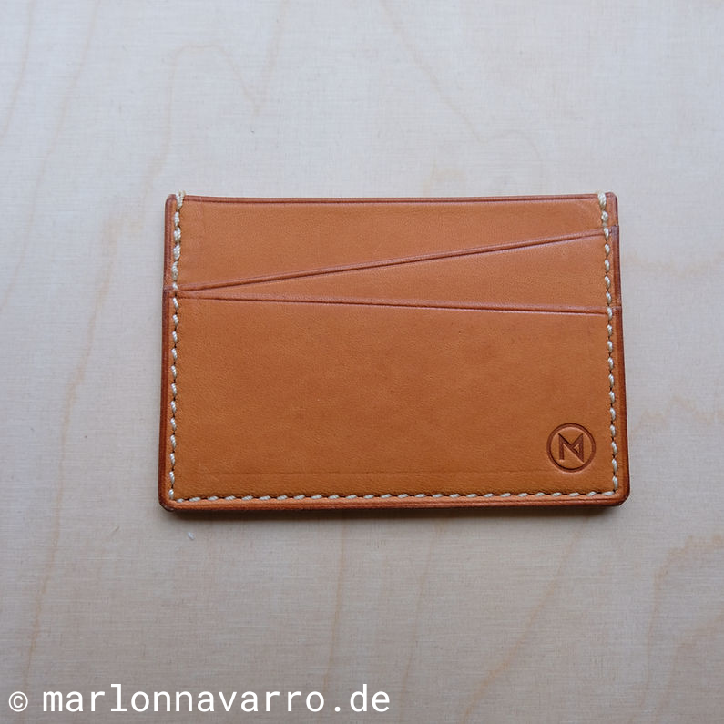
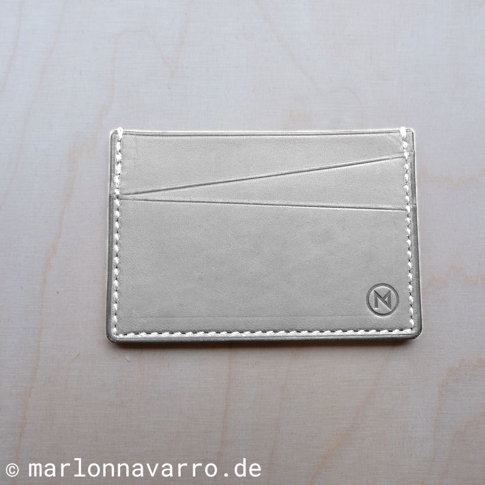
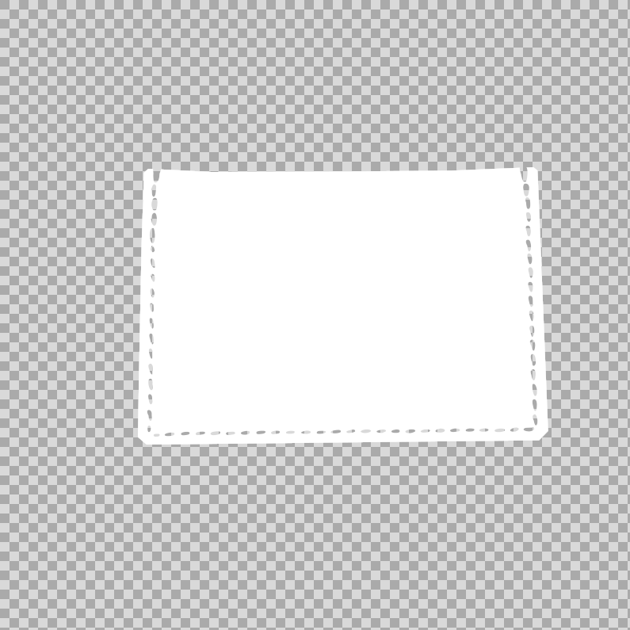
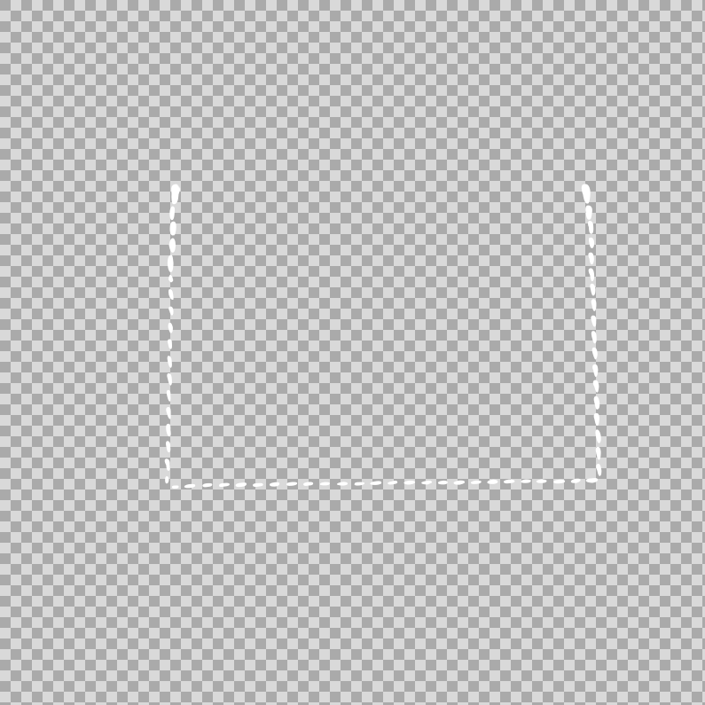

# product-configurator-prototype

Various product configurator prototypes, to showcase 2D and 3D possibilities

Preview:

-   Product Configurator (2D): https://bandit1983.github.io/product-configurator-prototype/

## How it works

### Product Configurator (2D)

Multiple images are used to form one customisable product display. The were prepared in GIMP, but any other image editor can be used.

The layers above the background colorise individual parts, so this ones have to be selected and extracted properly, to maintain a realistic display while customisation.

There are 3 images/layers in the example:

-   background: the product, or just some chosen parts, was de-colorised, so that only the structure is visible, the colors will be applied through other layers
-   sewing threads: this were masked individually, but can also be done semi-automatically if the image is clear enough
-   leather: for this layer the selection of the product from the background layer was re-used, but the sewing threads selection was removed from it, to avoid overlapping and color bleeding

#### Image examples

Original

Background

Layer 1

Layer 2

